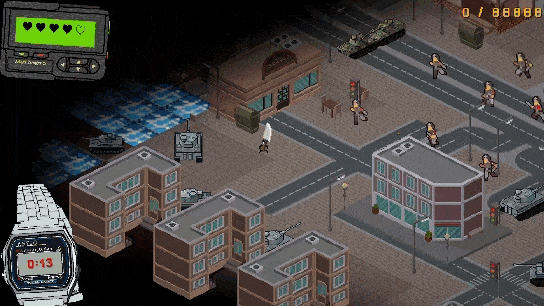
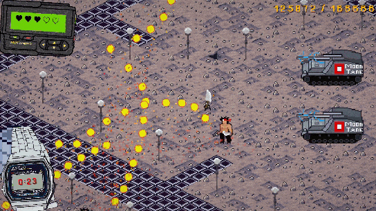
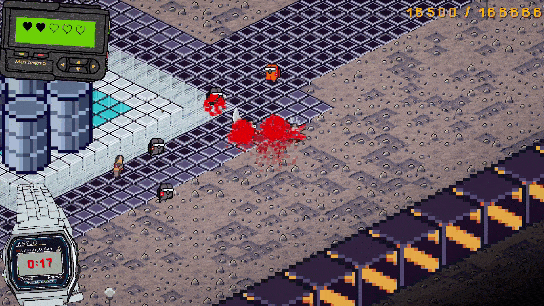
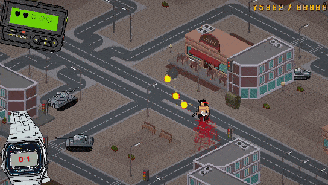

# The Knife Man (en)

## General Description

The Knife Man is a compact isometric action game built in Unity. You play as a knife-headed protagonist fighting through enemy waves across three short levels, reaching score targets, surviving each arena, and moving toward the final ending scene.

## What's implemented?

* Full scene flow: splash screen, main menu, three gameplay levels, and final titles scene
* Score-driven progression loop with per-level targets, win/lose states, restart flow, and level-to-level transition
* Keyboard and mouse combat: movement, dash, directional melee attacks, and damage feedback
* Six enemy types distributed across three levels with predefined wave compositions and spawn logic
* Enemy AI with behaviour trees, melee and ranged logic, projectile attacks, path checks, and NavMesh-based movement
* Reactive HUD with health cells, score counter, wave timer, pause, win, lose, and loading windows
* In-game settings for music, SFX, sound check, and easy mode toggle
* Audio, VFX, camera shake, and a video-based ending sequence

## Tech Stack

* **Core:** `Unity 2022.3.38f1`, `C#`
* **Rendering & UI:** `URP`, `Unity UI`, `TextMeshPro`, `Cinemachine`
* **Architecture:** `Zenject`, `State Machine`, `Service Layer`, `Factories`
* **Reactive & Animation:** `UniRx`, `DOTween`
* **AI & Navigation:** `Unity AI Navigation`, `NavMeshPlus`, `Behaviour Trees`
* **Input & Flow:** `Input System`, `Scene-based Flow`, `VideoPlayer`
* **Data & Tools:** `ScriptableObjects`, `Alchemy`, `KoboldUiFramework`, `UnityBehaviourTreeEditor`
* **Audio:** `Unity AudioSource Pipeline`

## Technical Focus

The project highlights several core Unity engineering areas: gameplay systems, combat feel, UI flow, enemy logic, and configurable content setup.

* Score-based level progression built around timed waves and per-level target thresholds
* DI-based project structure with installers, services, factories, and explicit scene composition
* Enemy logic split into reusable controllers and parts, with behaviour-tree-driven decision making
* Reactive UI and menu flow for HUD, loading, pause, lose/win states, and runtime settings
* ScriptableObject-driven setup for levels, enemy types, spawn rules, score tuning, VFX, and player parameters

## Supported Platforms

* HTML5
* Windows

## Useful Links

* [Link to itch.io of the project](https://kitchen-in-the-dungeon.itch.io/the-knife-man)

---

# The Knife Man (rus)

## Общее описание

The Knife Man это компактный изометрический action-проект на Unity. Игрок управляет персонажем-ножом, проходит три коротких уровня с волнами врагов, набирает целевой счёт, выживает в арене и доходит до финальной сцены с концовкой.

## Что реализовано?

* Полный flow по сценам: splash-экран, главное меню, три игровых уровня и финальная сцена с титрами
* Прогрессия по очкам с целевым счётом на каждом уровне, состояниями победы и поражения, рестартом и переходом между уровнями
* Боевая система под клавиатуру и мышь: перемещение, dash, направленные melee-атаки и визуальный отклик на получение урона
* Шесть типов врагов, распределённых по трём уровням, с заранее настроенными волнами и логикой спавна
* AI врагов на behaviour trees с melee/range логикой, projectile-атаками, проверкой пути и NavMesh-навигацией
* Реактивный HUD: ячейки здоровья, счётчик очков, таймер волны, pause, win, lose и loading-окна
* Встроенные настройки музыки и звуков, sound check и toggle для easy mode
* Аудио, VFX, camera shake и отдельная видео-концовка

## Технологический стек

* **Основа:** `Unity 2022.3.38f1`, `C#`
* **Рендер и UI:** `URP`, `Unity UI`, `TextMeshPro`, `Cinemachine`
* **Архитектура:** `Zenject`, `State Machine`, `Service Layer`, `Factories`
* **Reactive и анимации:** `UniRx`, `DOTween`
* **AI и навигация:** `Unity AI Navigation`, `NavMeshPlus`, `Behaviour Trees`
* **Input и flow:** `Input System`, `Scene-based Flow`, `VideoPlayer`
* **Данные и инструменты:** `ScriptableObjects`, `Alchemy`, `KoboldUiFramework`, `UnityBehaviourTreeEditor`
* **Аудио:** `Unity AudioSource Pipeline`

## Технические акценты

Проект собран вокруг нескольких сильных инженерных зон Unity-разработки: gameplay-систем, боевого фидбэка, UI flow, логики врагов и конфигурируемого контента.

* Прогрессия уровня построена вокруг таймированных волн и целевого счёта для каждого этапа
* Структура проекта собрана через DI с installers, services, factories и явной сценовой композицией
* Логика врагов разбита на переиспользуемые controller/part-модули и decision making через behaviour trees
* UI и меню работают реактивно: HUD, loading, pause, lose/win состояния и runtime-настройки
* Ключевые игровые данные вынесены в ScriptableObjects: уровни, типы врагов, правила спавна, настройка счёта, VFX и параметры игрока

## Поддерживаемые платформы

* HTML5
* Windows

## Ссылки

* [Ссылка на itch.io проекта](https://kitchen-in-the-dungeon.itch.io/the-knife-man)
